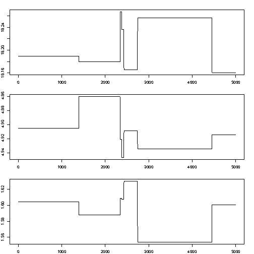
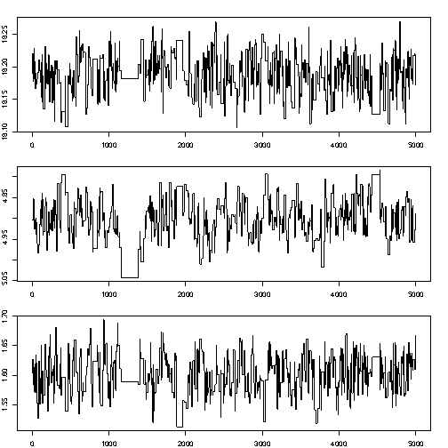

# 3. Optimization 

# 3.1 linear systems
Take $x_1$ the example

```{r}
options("digits")
```

$$
	\begin{array}{ll}
	a x_{11} + b x_{12} & = y_1 \\\\
	a x_{21} + b x_{22} & = y_2
	\end{array}
$$

with the $x$ and $y$ values known, and $a$ and $b$ unknown. This is
similar to fitting a straight line through two points: let $(x_1,y_1)$
be the first point and $(x_2,y_2)$ be the second, then
$$
	\begin{array}{ll}
	a + b x_1 & = y_1 \\\\
	a + b x_2 & = y_2
	\end{array}
$$
The approach is substition: rewrite one equations such that isolates
$a$ or $b$, and substitute that in the second.

# 3.2 Matrix notation

We can rewrite
$$
	\begin{array}{ll}
	a x_{11} + b x_{12} & = y_1\\\\
	a x_{21} + b x_{22} & = y_2
	\end{array}
$$
as the matrix product
$$
  \left[
  \begin{array}{ll}
  x_{11} & x_{12}\\\\
  x_{21} & x_{22} 
  \end{array}
  \right] 
  \left[
  \begin{array}{l}
  a \\\\ b
  \end{array}
  \right]
  =
  \left[
  \begin{array}{l}
  y_1 \\\\ y_2
  \end{array}
  \right]
$$
or
$$Xa = y$$

# Matrix transposition
The transpose of a matrix is the matrix formed when rows and columns are reversed.
If
$$A = 
	\left[
	\begin{array}{rr}
	1 & 4 \\\\
	2 & -1 \\\\
	8 & 9 \\\\
	\end{array}
	\right] 
$$
then it's transpose,
$$
	A' = \left[
	\begin{array}{rrr}
	1 & 2 & 8 \\\\
	4 & -1 & 9 \\\\
	\end{array}
	\right] 
$$
(and may be written as $A^T$)

# Matrix inverse and identity
The identity matrix is square (nr of rows equals nr of columns), 
has ones on the diagona (for which the row number equals the column
number) and zeroes elsewhere. E.g. the $3 \times 3$ identity
$$
	I = \left[
	\begin{array}{lll}
	1 & 0 & 0 \\\\
	0 & 1 & 0 \\\\
	0 & 0 & 1 \\\\
	\end{array}
	\right] 
$$
The _inverse_ of a square matrix $X$, $X^{-1}$, is _defined_ by 
the products
$$X^{-1}X = I$$ and $$X X^{-1}=I$$

Suppose we have $n$ equations with $p$ unknowns:
$$
	\begin{array}{cccccc}
	a_1 x_{11} + a_2 x_{12} + & ... & + & a_p x_{1p} & = & y_1 \\\\
	a_1 x_{21} + a_2 x_{22} + & ... & + & a_p x_{2p} & = & y_2 \\\\
	\vdots & \ddots & & \vdots & & \vdots \\\\
	a_1 x_{n1} + a_2 x_{n2} + & ... & + & a_p x_{np} & = & y_n
	\end{array}
$$ 
we can rewrite this in matrix notation as $Xa=y$, with $x_{ij}$
corresponding to element $(i,j)$ (row i, column j) in $X$, having $n$
rows and $p$ columns; $a$ and $y$ column vectors having $p$ and $n$
elements, respectively. Now, $X$ and $y$ are known, and $a$ is unknown.
$a$
Solutions:
* if $p > n$, there is no single solution
* if $p = n$ and $X$ is not singular, then $a = X^{-1}y$
* if $p < n$ we have an overdetermined system, and may e.g. look for
a least square (best approximating) solution.

# Linear least squares solution
If $p < n$, a solution usually does not exist: try fitting a straight
line through three or more arbitrary points.

Now rewrite $Xa = y$ as $y=Xb+e$, with $e$ the distance (in $y$-direction)
from the line. If we want to minimize the sum of squared distances, then
we need to find $b$ for which $R=\sum_{i=1}^n e_i^2$ is minimum. In matrix
terms, $R = (y-Xb)'(y-Xb)$ with $'$ denoting transpose (row/col swap).
$$\frac{\delta R}{\delta b} = 0$$
$$\frac{\delta (y-Xb)'(y-Xb)}{\delta b} = 0$$
$$\frac{\delta (y'y - (Xb)'y- y'(Xb) + (Xb)'Xb)}{\delta b} = 0$$

$$\frac{\delta (y'y - (Xb)'y- y'(Xb) + (Xb)'Xb)}{\delta b} = 0$$
now you should first note that $(Xb)'=b'X'$, and second that 
$b'X'y=y'Xb$ because these are scalars. Then,
$$-2X'y + 2X'Xb = 0$$
$$X'Xb = X'y$$
$$b = (X'X)^{-1}X'y$$
this yields the least squares solution for $b$; the solution
equations are called the _normal equations_.

# The practice of solving systems
when we write
$$A x = b$$
with known $A$ and $b$ and unknown $x$, the solution is
$$x = A^{-1}b$$
In practice however, we do not need to compute $A^{-1}$,
but can directly solve for $x$. This is much cheaper.
```{r}
m=matrix(0,3000,3000)
diag(m)=1
system.time(x <- solve(m))
system.time(x <- solve(m,rep(0,3000)))
```

```{r}
X=cbind(c(1,1,1),c(1,2,3))
X
y = c(1,0,2)
solve(t(X) %*% X, t(X) %*% y)
plot(X[,2], y, xlim = c(0,3), asp = 1)
abline(lm(y~X[,2]))
```

# 3.2 Non-linear Optimization

*  one-dimensional search on a unimodal function: golden search
*  non-linear least squares: the Gauss Newton algorithm
*   probabilistic methods: global search
  * Metropolis-Hastings
  * Simulated Annealing

# Golden search
Golden ratio:
$$
	\frac{x_1}{x_2} = \frac{x_2}{x_1+x_2}
$$
Solution (check): if $x_1=1$, then $x_2\approx1.618$ or $x_2\approx0.618$

Found in: art, sculpture, geometry (pentagrams), Egyptian pyramides, architecture,
nature, A4 paper, ...

# Minimum outside current section

* http://ifgi.uni-muenster.de/~epebe_01/golden1.pdf

# Minimum inside current section
* http://ifgi.uni-muenster.de/~epebe_01/golden2.pdf
* http://ifgi.uni-muenster.de/~epebe_01/golden3.pdf
* http://ifgi.uni-muenster.de/~epebe_01/golden4.pdf
* http://ifgi.uni-muenster.de/~epebe_01/golden5.pdf
* http://ifgi.uni-muenster.de/~epebe_01/golden6.pdf

# the algorithm
Recursive zooming:

1. find three GR points, a, b and c such that the minimum lies within a and c
2. put a point d in the largest section according to GR, with the smallest
interval closest to the smallest value
3. (In case of adbc) determine whether the mininum is between a and b or d and c
4. continue with either adb or dbc as if it were abc, unless we're sufficiently
close (in terms of our goal, or of numerical resolution)

# Combined linear and golden search

Spherical variogram with nugget has three parameters: nugget $c_0$,
(partial) sill $c_1$ and range $a$:
$$
\gamma(h) = \left\{
\begin{array}{ll}
		  0 & \mbox{if}\ \  h = 0 \\\\
		  c_0 + c_1 f(a,h) & \mbox{if}\ \  h > 0 \\\\
\end{array}
\right.
$$
with 
$$f(a, h)= \left\{
\begin{array}{ll}
\frac{3h}{2a}-\frac{1}{2}(\frac{h}{a})^3 & \mbox{if} \ \ 0 \le h \le a \\\\
1 & \mbox{if} \ \ h > a \\\\
\end{array}
\right.
$$

# Approach:
Provide an initial estimate $a_0$; then iterate:
1. given current fit for $a$, fit the linear coefficients $c_0$ and $c_1$
2. given this fit, do golden search for $a$
until convergence (vector $(a,c_0,c_1)$ does not move).

```{r fig.width=10, fig.height=5}
library(sp)
data(meuse)
coordinates(meuse) = ~x+y
library(gstat)
v = variogram(log(zinc)~1, meuse)
m = vgm(0.5, "Sph", 700, 0.1)
plot(v)
plot(v, vgm(0.5, "Sph", 700, 0.1))
plot(v, fit.variogram(v, vgm(0.5, "Sph", 700, 0.1)))
```

# Gauss-Newton
Golden search may be used for any criterion, e.g. $f(x)=\sum_{i=1}^n
g_i(x)^p$ for any chosen $p$. If we limit ourselves to _least
squares_ (i.e., $p=2$) and want to generalize this for higher dimensional
(i.e., multiple parameter) $x$ (e.g. $x=[x_1,...,x_q]'$) we may use the
Gauss-Newton algorithm (non-linear least squares).

# the Gauss-Newton algorithm 
Problem: given a model $y=g(X,\theta)+e$ find
$$\mbox{min}_\theta \sum (y - g(X,\theta))^2$$
Let $f_i(\theta)=y_i - g(X_i,\theta)$, so we minimize $R=\sum_{i=1}^n (f_i(\theta))^2$

This is a problem from space $(1 \times n)$ to $(1 \times m)$

Given a \color{red}starting value\color{black}\ $\theta^0$ we search the direction of steepest
descent in terms of $R$, using first order derivatives of $R$ towards
$\theta$. By iteration, from $\theta^k$ we find $\theta^{k+1}$ by
$$\theta^{k+1}=\theta^k + \delta^k$$
until we have convergence.

Let the Jakobian be
$$
J_f(\theta^k) =
\left[
\begin{array}{ccccc}
\frac{\delta f_1(\theta^k)}{\delta\theta_1} & ... &  \frac{\delta f_1(\theta^k)}{\delta\theta_m} \\\\
\vdots & \ddots & \vdots \\\\
\frac{\delta f_n(\theta^k)}{\delta\theta_1} & ... &  \frac{\delta f_n(\theta^k)}{\delta\theta_m} \\\\
\end{array}
\right]
$$ 
In
$$\theta^{k+1}=\theta^k + \delta^k$$
we find $\delta^k$ by solving
$$
J_f(\theta_k)'J_f(\theta_k) \delta^k = - J_f(\theta_k)'f(\theta^k)
$$
What if $\delta f_n(\theta^k)/ \delta \theta$ is unknown?

# Gauss-Newton and the Normal equations
Recall that in multiple _linear_ regression, with $y=X\theta+e$ the
solution is given by the normal equations
$$X'X\theta = X'y$$
Note that here, the Jacobian of $y-X\theta$ is $-X$, so if we
take (arbitrarily) $\theta_0 = (0,0,...,0)'$, then 
$$
J_f(\theta_k)'J_f(\theta_k) \delta^k = - J_f(\theta_k) f(\theta^k)
$$
yields after one step the final 
solution $\delta^1=\theta$, as $(-X)'(-X)\delta=X'y$. 

Other starting points yield the same solution for $\theta$.

Further steps will not improve it (i.e., yield $\delta^k=0$).

\frame{\includegraphics[width=.9\columnwidth]{Banana-SteepDesc}}

# Problems with steepest descent
* (see previous slide:) steepest descent may be very slow
* Main problem: a minimum may be _local_, other
initial values may result in other, better minima
* Cure: apply Gauss-Newton from many different starting
points (cumbersome, costly, cpu intensive)
* Global search:
  * apply a grid search -- curse of dimensionality. E.g. for three
 parameters, 50 grid nodes along each direction: $50^3= 125000$
  * apply random sampling (same problem)
  * use search methods that not _only_ go downhill:
    * Metropolis-Hastings (sampling)
    * Simulated Annealing (optimizing)

# Metropolis-Hastings
Why would one want probabilistic search?
* global--unlikely areas are searched too (with small probability)
* a probability distribution is richer than a point estimate:
Gauss-Newton provides an estimate of $\hat\theta$ of $\theta$, given
data $y$. What about the estimation error $\hat\theta - \theta$?
Second-order derivatives give approximations to standard errors, but
not the full distribution.

We explain the simplified version, the Metropolis algorithm

# Metropolis algorithm
Given a point in parameter space $\theta$, say $x_t =
(\theta_{1,t},...,\theta_{p,t})$ we evaluate whether another point, $x'$
is a reasonable alternative. If accepted, we set $x_{t+1}\leftarrow x'$; if not
we keep $x_t$ and set $x_{t+1}\leftarrow x_t$.
* if $P(x') > P(x_t)$, we accept $x'$ and set $x_{t+1}=x'$
* if $P(x') < P(x_t)$, then
 * we draw $U$, a random uniform value from $[0,1]$, and
 * accept $x'$ if $U < \frac{P(x')}{P(x_t)}$

Often, $x'$ is drawn from some normal distribution centered around $x_t$:
$N(x_t,\sigma^2 I)$. Suppose we accept it always, then
$$x_{t+1}=x_t + e_t$$
with $e_t \sim N(0,\sigma^2 I)$. Looks familiar?

# Burn-in, tuning $\sigma^2$
* When run for a long time, the Metropolis (and its generalization Metropolis-Hastings) 
algorithm provide a _correlated_ sample of the parameter distribution
* M and MH algorithms provide Markov Chain Monte Carlo samples; another
even more popular algorithm is the Gibb's sampler (WinBUGS).
* As the starting value may be quite unlikely, the first part of the 
chain (burn-in) is usually discarded.
* if $\sigma^2$ is too small, the chain mixes too slowly (consecutive
samples are too similar, and do not describe the full PDF)
* if $\sigma^2$ is too large, most proposal values are not accepted
* often, during burn-in, $\sigma^2$ is tuned such that acceptance rate
is close to 60\%.
* many chains can be run, using different starting values, in parallel

### Little mixing (too low acceptance rate):


### Better mixing:


### Still better mixing:


### Little mixing (too high acceptance rate: too much autocorrelation)


# Likelihood ratio -- side track
For evaluating acceptance, the ratio $\frac{P(x')}{P(x_t)}$ is needed,
not the individual values.

This means that $P(x')$ and $P(x_t)$ are only needed _up to a
normalizing constant_: if we have values $aP(x')$ and $aP(x_t)$, than
that is sufficient as $a$ cancels out.

This result is _key_ to the reason that MCMC and M-H are
\color{red}the work horse\color{black}\ in Bayesian statistics, where
$P(x')$ is extremely hard to find because it calls for the evaluation of
a very high-dimensional integral (the normalizing constant that makes
sure that $P(\cdot)$ is a probability) but $aP(x')$, the likelihood of
$x$ given data, is much easier to find!

# Likelihood function for normal distribution
Normal probability density function:
$$Pr(x) = \frac{1}{\sigma\sqrt{2\pi}}\exp(-\frac{(x-\mu)^2}{2\sigma^2})$$
Likelihood, 
Multivariate; independent observations:
$$Pr(x_1,x_2,...,x_p;\mu,\sigma) = \prod_{i=1}^p Pr(x_i)$$
which is proportional to
$$\exp(-\frac{\sum_{i=1}^n(x_i-\mu)^2}{2\sigma^2})$$

# Simulated annealing
Simulated Annealing is a related global search algorithm, does not sample
the full parameter distribution but searches for the (global) optimimum.

The analogy with _annealing_, the forming of crystals in a slowly
cooling substance, is the following:

The current solution is replaced by a worse "nearby" solution with a
certain probability that depends on the the degree to which the "nearby"
solution is worse, and on the temperature of the cooling process; this
temperature slowly decreases, allowing less and smaller changes.

At the start, temperature is large and search is close to random; when
temperature decreases search is more and more local and downhill. Random,
uphill jumps prevent SA to fall into a local minimum.

A related algorithm (stochastic optimization) is the Genetic Algorithm.
